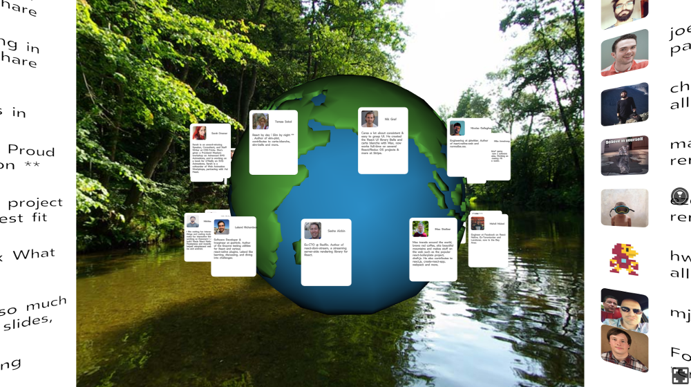
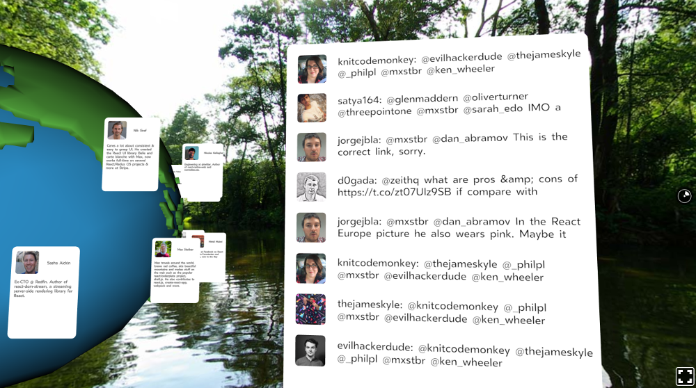
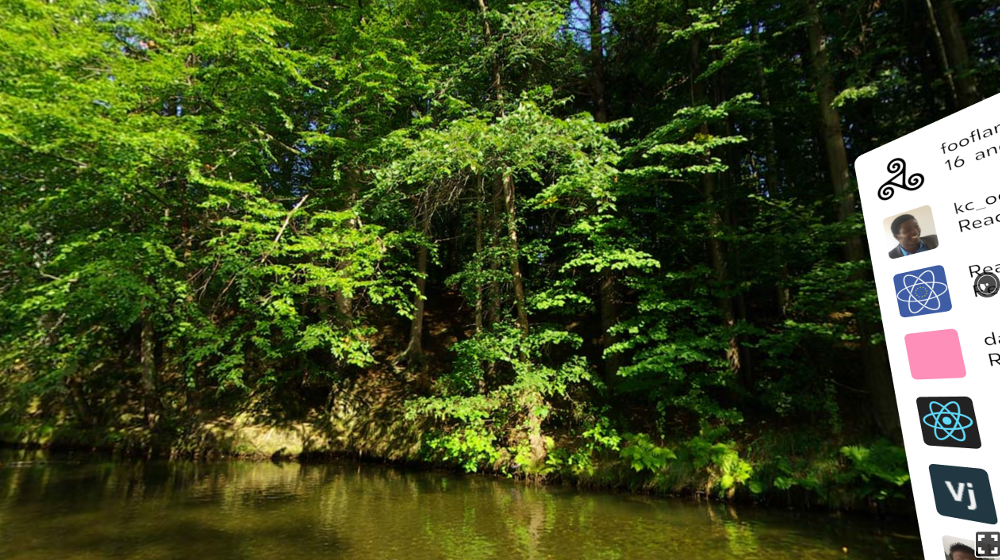

# React Europe 2017 / Mozilla Hackathon project

## Team:

- Sven SAULEAU (@xtuc)
- Federico Zivolo (@FezVrasta)

## Requirements

- Use React Europe GraphQL API
- Use React VR

## Challenges

We never used Apollo and GraphQL before.  
It was the second React VR project for @FezVrasta and the first for @xtuc.

## Result

We won the hackathon 😉
https://twitter.com/gabriel_micko/status/865969661736890368
